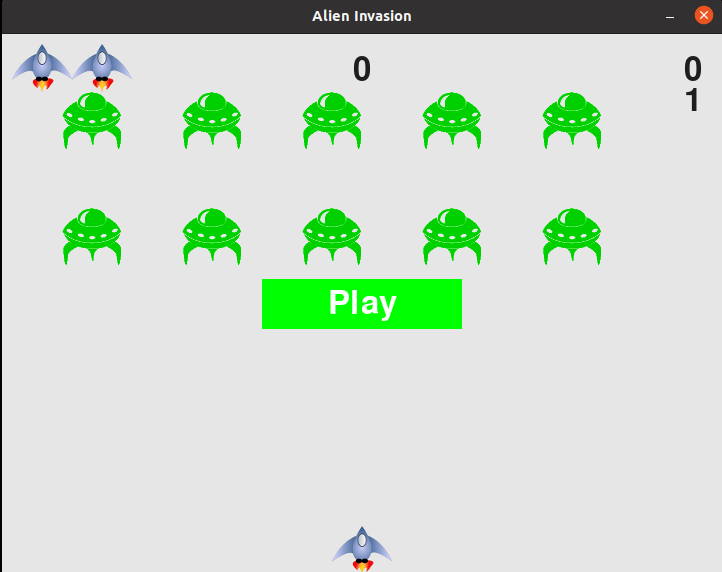
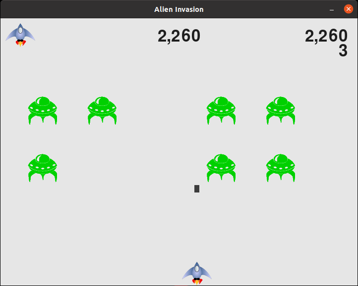
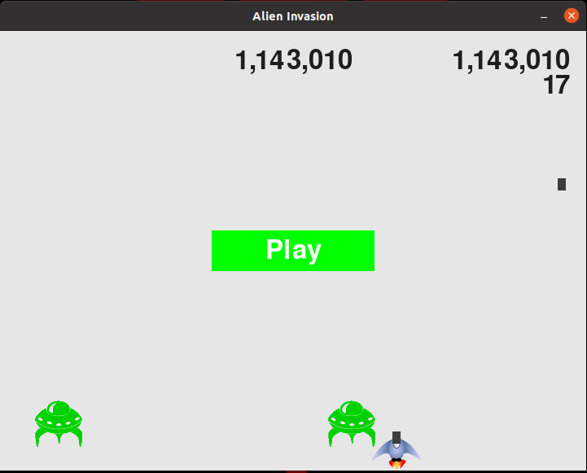
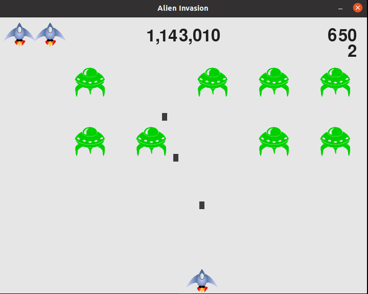

<div id="top"></div>
<!--
*** Thanks for checking out the Best-README-Template. If you have a suggestion
*** that would make this better, please fork the repo and create a pull request
*** or simply open an issue with the tag "enhancement".
*** Don't forget to give the project a star!
*** Thanks again! Now go create something AMAZING! :D
-->


<!-- PROJECT SHIELDS -->
<!--
*** I'm using markdown "reference style" links for readability.
*** Reference links are enclosed in brackets [ ] instead of parentheses ( ).
*** See the bottom of this document for the declaration of the reference variables
*** for contributors-url, forks-url, etc. This is an optional, concise syntax you may use.
*** https://www.markdownguide.org/basic-syntax/#reference-style-links
-->
[![Contributors][contributors-shield]][contributors-url]
[![Forks][forks-shield]][forks-url]
[![Stargazers][stars-shield]][stars-url]
[![Issues][issues-shield]][issues-url]
[![MIT License][license-shield]][license-url]
[![LinkedIn][linkedin-shield]][linkedin-url]


<!-- PROJECT LOGO -->
<br />
<div align="center">
  <a href="https://github.com/kartikey104/alien_invasion">
    
  </a>

  <h3 align="center">ALIEN_INVASION</h3>

  <p align="center">
    A Python3 game made with Pygame module
    <br />
    <a href="https://github.com/kartikey104/alien_invasion"><strong>Explore the docs »</strong></a>
    <br />
    <br />
    <!--- 
    <a href="https://github.com/othneildrew/Best-README-Template">View Demo</a>
    ·
    -->
    <a href="https://github.com/kartikey104/alien_invasion/issues">Report Bug</a>
    ·
    <a href="https://github.com/kartikey104/alien_invasion/issues">Request Feature</a>
  </p>
</div>


<!-- TABLE OF CONTENTS -->
<details>
  <summary>Table of Contents</summary>
  <ol>
    <li>
      <a href="#about-the-project">About The Project</a>
      <ul>
        <li><a href="#built-with">Built With</a></li>
      </ul>
    </li>
    <li>
      <a href="#getting-started">Getting Started</a>
      <ul>
        <li><a href="#prerequisites">Prerequisites</a></li>
        <li><a href="#installation">Installation</a></li>
      </ul>
    </li>
    <li><a href="#usage">Usage</a></li>
    <li><a href="#roadmap">Roadmap</a></li>
    <li><a href="#contributing">Contributing</a></li>
    <li><a href="#license">License</a></li>
    <li><a href="#contact">Contact</a></li>
    <li><a href="#acknowledgments">Acknowledgments</a></li>
  </ol>
</details>


<!-- ABOUT THE PROJECT -->
## About The Project

[![Product Name Screen Shot][product-screenshot]](https://github.com/kartikey104/alien_invasion)

This game was made using python and pygame and inspired from a project in the book [Python Crash Course, 2e](https://nostarch.com/pythoncrashcourse2e) by [Eric Matthes](https://github.com/ehmatthes).

<p align="right">(<a href="#top">back to top</a>)</p>


### Built With


* [pygame2](https://www.pygame.org/news)
* [Python3](https://www.python.org/)

<p align="right">(<a href="#top">back to top</a>)</p>


<!-- GETTING STARTED -->
## Getting Started

To get a local copy up and running follow these simple steps. The instructions are for linux and I used [Ubuntu 20.04 LTS](https://ubuntu.com/)

### Prerequisites

List of things you need to use the software and how to install them.
* Python3
  ```sh
  sudo apt update
  sudo apt install python3.8
  ```

* Pygame2
 ```sh
 python3 -m pip install -U pygame --user
 #To see if it works, run one of the included examples:
 python3 -m pygame.examples.aliens
 ```
     
### Installation


1. Clone the repo
   ```sh
   git clone https://github.com/kartikey104/alien_invasion.git
   ```
<p align="right">(<a href="#top">back to top</a>)</p>


<!-- USAGE EXAMPLES -->
## Usage

Go to cloned repo and run the following to start the game:
   ```sh
   python3 alien_invasion.py
   ```

<hr>

<hr>

<!---->

<p align="right">(<a href="#top">back to top</a>)</p>


<!-- ROADMAP -->
## Roadmap

- [x] Increase game speed after each level
- [ ] Add a gif for game in README
- [ ] Add Different types of aliens
- [ ] Powerups
- [ ] Full Screen
- [ ] Settings Menu
    - [ ] Difficulty level

See the [open issues](https://github.com/kartikey104/alien_invasion/issues) for a full list of proposed features (and known issues).

<p align="right">(<a href="#top">back to top</a>)</p>


<!-- CONTRIBUTING -->
## Contributing

Contributions are what make the open source community such an amazing place to learn, inspire, and create. Any contributions you make are **greatly appreciated**.

If you have a suggestion that would make this better, please fork the repo and create a pull request. You can also simply open an issue with the tag "enhancement".
Don't forget to give the project a star! Thanks again!

1. Fork the Project
2. Create your Feature Branch (`git checkout -b feature/AmazingFeature`)
3. Commit your Changes (`git commit -m 'Add some AmazingFeature'`)
4. Push to the Branch (`git push origin feature/AmazingFeature`)
5. Open a Pull Request

<p align="right">(<a href="#top">back to top</a>)</p>


<!-- LICENSE -->
## License

Distributed under the MIT License. See `LICENSE.txt` for more information.

<p align="right">(<a href="#top">back to top</a>)</p>


<!-- CONTACT -->
## Contact

Kartikey Agarwal - [@kartikey104](https://twitter.com/kartikey104)

Project Link: [https://github.com/kartikey104/alien_invasion](https://github.com/kartikey104/alien_invasion)

<p align="right">(<a href="#top">back to top</a>)</p>


<!-- ACKNOWLEDGMENTS -->
## Acknowledgments

* [Book - Python Crash Course, 2e](https://nostarch.com/pythoncrashcourse2e)
* [Original Source Code](https://github.com/ehmatthes/pcc_2e/tree/master/chapter_14/scoring)
* [Made with VSC](https://code.visualstudio.com/)
* [README template](https://github.com/othneildrew/Best-README-Template)

<p align="right">(<a href="#top">back to top</a>)</p>


<!-- MARKDOWN LINKS & IMAGES -->
<!-- https://www.markdownguide.org/basic-syntax/#reference-style-links -->
[contributors-shield]: https://img.shields.io/github/contributors/kartikey104/alien_invasion.svg?style=for-the-badge
[contributors-url]: https://github.com/kartikey104/alien_invasion/graphs/contributors
[forks-shield]: https://img.shields.io/github/forks/kartikey104/alien_invasion.svg?style=for-the-badge
[forks-url]: https://github.com/kartikey104/alien_invasion/network/members
[stars-shield]: https://img.shields.io/github/stars/kartikey104/alien_invasion.svg?style=for-the-badge
[stars-url]: https://github.com/kartikey104/alien_invasion/stargazers
[issues-shield]: https://img.shields.io/github/issues/kartikey104/alien_invasion.svg?style=for-the-badge
[issues-url]: https://github.com/kartikey104/alien_invasion/issues
[license-shield]: https://img.shields.io/github/license/kartikey104/alien_invasion.svg?style=for-the-badge
[license-url]: https://github.com/kartikey104/alien_invasion/LICENSE.txt
[linkedin-shield]: https://img.shields.io/badge/-LinkedIn-black.svg?style=for-the-badge&logo=linkedin&colorB=555
[linkedin-url]: https://www.linkedin.com/in/kartikey-agarwal-8b92b81a3/
[product-screenshot]: images/ss4.png